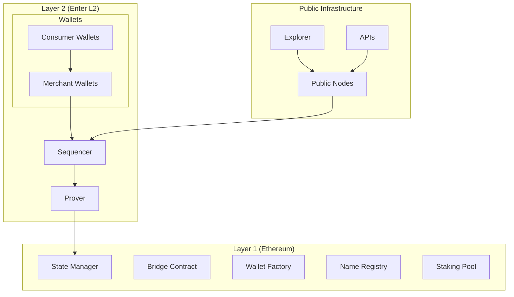
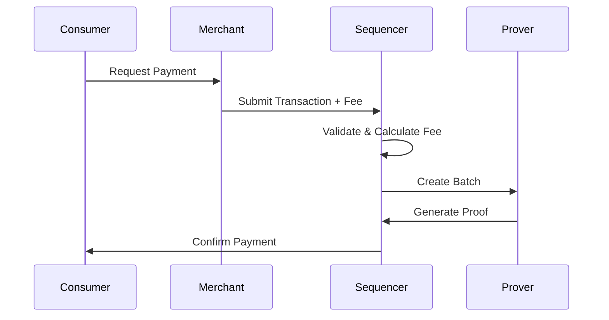

# Enter L2 Whitepaper

**A ZK Rollup-based Stablecoin Payment Network with Merchant-Paid Fees**

*Version 1.0 - December 2024*

## Abstract

Enter L2 is a specialized Layer 2 scaling solution built on Ethereum, designed specifically for stablecoin payments with a unique merchant-paid fee model. By implementing role-based wallets and ZK rollup technology, Enter L2 enables gasless transactions for consumers while providing merchants with powerful payment processing capabilities.

The network introduces two distinct wallet types: Consumer Wallets that can only receive payments from merchants, and Merchant Wallets that handle all transaction fees and provide full payment functionality. This design eliminates the complexity of gas fees for end users while creating a sustainable economic model for payment processors.

## 1. Introduction

### 1.1 Problem Statement

Current Layer 2 solutions, while reducing transaction costs, still require end users to:
- Understand and manage gas fees
- Hold native tokens for transaction costs
- Navigate complex wallet interfaces
- Deal with failed transactions due to insufficient gas

These barriers prevent mainstream adoption of blockchain-based payments, particularly for everyday transactions where users expect the simplicity of traditional payment systems.

### 1.2 Solution Overview

Enter L2 addresses these challenges through:

1. **Role-Based Wallet Architecture**: Distinct consumer and merchant wallet types with different capabilities
2. **Merchant-Paid Fees**: Automatic fee payment by merchants for all consumer transactions
3. **ZK Rollup Technology**: High throughput and low costs through batch processing
4. **Stablecoin Focus**: Optimized for USDC/USDT payments with automatic fee conversion
5. **Consumer-Friendly UX**: Gasless transactions with 5-second finality

## 2. Architecture

### 2.1 System Overview



### 2.2 Core Components

#### 2.2.1 Sequencer
The sequencer is responsible for:
- Transaction ordering and validation
- Batch creation and optimization
- State transition execution
- Fee calculation and collection

#### 2.2.2 Prover
The prover generates ZK proofs for:
- Transaction validity
- State transitions
- Batch correctness
- Bridge operations

#### 2.2.3 State Manager (L1)
The L1 state manager contract:
- Stores L2 state roots
- Verifies ZK proofs
- Handles dispute resolution
- Manages emergency procedures

## 3. Wallet Architecture

### 3.1 Consumer Wallets

Consumer wallets are designed for end users and have the following characteristics:

**Capabilities:**
- Receive payments from merchant wallets
- View transaction history
- Manage multiple token balances
- Register and manage names

**Restrictions:**
- Cannot initiate outbound transactions
- Cannot pay transaction fees
- Cannot interact with arbitrary contracts

**Implementation:**
```solidity
contract ConsumerWallet {
    address public owner;
    mapping(address => bool) public authorizedMerchants;
    
    modifier onlyAuthorizedMerchant() {
        require(authorizedMerchants[msg.sender], "Unauthorized merchant");
        _;
    }
    
    function receivePayment(
        address token,
        uint256 amount,
        bytes calldata data
    ) external onlyAuthorizedMerchant {
        // Payment logic
    }
}
```

### 3.2 Merchant Wallets

Merchant wallets provide full functionality for payment processors:

**Capabilities:**
- Send payments to any address
- Pay fees for consumer transactions
- Manage whitelists and spending limits
- Operate with multiple authorized operators
- Interact with all network contracts

**Fee Management:**
- Automatic fee calculation for consumer transactions
- Support for USDC/USDT fee payments
- Price oracle integration for fee conversion
- Daily spending limits and controls

**Implementation:**
```solidity
contract MerchantWallet {
    address public owner;
    mapping(address => bool) public operators;
    mapping(address => bool) public whitelist;
    uint256 public dailyLimit;
    uint256 public dailySpent;
    uint256 public lastResetTime;
    
    modifier onlyOperator() {
        require(operators[msg.sender] || msg.sender == owner, "Unauthorized");
        _;
    }
    
    function sendPayment(
        address to,
        address token,
        uint256 amount,
        uint256 maxFee
    ) external onlyOperator {
        // Payment and fee logic
    }
}
```

## 4. ZK Proof System

### 4.1 Circuit Design

Enter L2 uses Halo2-based circuits optimized for payment transactions:

#### 4.1.1 Payment Circuit
Verifies:
- Sender authorization and balance
- Recipient validity (consumer wallet checks)
- Fee calculation and payment
- State transitions

#### 4.1.2 Bridge Circuit
Handles:
- L1 deposit verification
- L2 withdrawal processing
- Cross-chain state synchronization

#### 4.1.3 Batch Circuit
Processes:
- Multiple transaction validation
- Merkle tree updates
- State root computation

### 4.2 Proof Generation

```rust
pub struct PaymentCircuit {
    pub sender: Address,
    pub recipient: Address,
    pub amount: U256,
    pub fee: U256,
    pub fee_payer: Address,
    pub nonce: u64,
    pub signature: Signature,
}

impl Circuit<Fr> for PaymentCircuit {
    fn synthesize<CS: ConstraintSystem<Fr>>(
        self,
        cs: &mut CS,
    ) -> Result<(), SynthesisError> {
        // Circuit implementation
    }
}
```

## 5. Fee Model

### 5.1 Merchant-Paid Fee Structure

The fee model is designed to incentivize merchant adoption while ensuring network sustainability:

**Fee Components:**
1. **Base Fee**: Fixed cost per transaction (0.001 USDC)
2. **Gas Fee**: Variable cost based on computation (dynamic)
3. **Network Fee**: Revenue for validators and stakers (0.0005 USDC)

**Fee Payment Flow:**


### 5.2 Fee Optimization

**Batch Processing:**
- Multiple transactions in single proof
- Amortized proving costs
- Reduced L1 gas consumption

**Dynamic Pricing:**
- Real-time fee adjustment based on network congestion
- Merchant fee caps and limits
- Automatic USDC/ETH conversion

## 6. Naming System

### 6.1 Name Registration

Enter L2 implements an ENS-like naming system with phone number integration:

**Features:**
- Human-readable names (alice.enter)
- Phone number verification and linking
- Primary name designation
- Reverse resolution

**Registration Process:**
```solidity
contract NameRegistry {
    struct NameInfo {
        address owner;
        address resolver;
        uint256 expiresAt;
        bool isPrimary;
        string phoneNumber;
        bool phoneVerified;
    }
    
    mapping(bytes32 => NameInfo) public names;
    
    function registerName(
        string calldata name,
        address resolver,
        uint256 duration
    ) external payable {
        // Registration logic
    }
}
```

### 6.2 Phone Integration

**Verification Process:**
1. User submits phone number
2. SMS verification code sent
3. Code verification on-chain
4. Phone number linked to address

## 7. Staking and Governance

### 7.1 Staking Mechanism

**Staking Features:**
- Token staking with lock periods
- Multiplier rewards for longer locks
- Profit sharing from network fees
- Slashing for malicious behavior

**Reward Distribution:**
```solidity
contract StakingPool {
    struct StakeInfo {
        uint256 amount;
        uint256 lockPeriod;
        uint256 lockedUntil;
        uint256 multiplier;
        uint256 rewardsClaimed;
    }
    
    function stake(uint256 amount, uint256 lockPeriod) external {
        // Staking logic with multiplier calculation
    }
    
    function claimRewards() external {
        // Reward distribution logic
    }
}
```

### 7.2 Governance

**Governance Parameters:**
- Fee structure adjustments
- Contract upgrades
- Emergency procedures
- Network parameters

## 8. Security Model

### 8.1 Threat Analysis

**Potential Attacks:**
1. **Sequencer Censorship**: Mitigated by forced inclusion mechanism
2. **Invalid State Transitions**: Prevented by ZK proof verification
3. **Bridge Exploits**: Protected by time delays and multi-sig
4. **Wallet Compromise**: Limited by role-based permissions

### 8.2 Security Measures

**ZK Proof Verification:**
- All state transitions verified on L1
- Public verification keys
- Independent proof verification by nodes

**Emergency Procedures:**
- Circuit breaker for suspicious activity
- Withdrawal delays for large amounts
- Multi-signature requirements for upgrades

## 9. Performance Analysis

### 9.1 Throughput

**Target Metrics:**
- 1,000+ TPS sustained throughput
- 5-second transaction finality
- 99.9% uptime guarantee
- <$0.01 average transaction cost

### 9.2 Scalability

**Horizontal Scaling:**
- Multiple sequencer support (future)
- Sharded state management
- Parallel proof generation
- Load balancing across nodes

## 10. Economic Model

### 10.1 Token Economics

**Utility Token (ENTER):**
- Staking for network security
- Governance participation
- Fee payment (alternative to USDC)
- Reward distribution

**Fee Revenue Distribution:**
- 40% to stakers
- 30% to development fund
- 20% to node operators
- 10% to treasury

### 10.2 Merchant Incentives

**Benefits for Merchants:**
- Simplified payment processing
- Reduced customer friction
- Batch transaction discounts
- Volume-based fee reductions

## 11. Roadmap

### 11.1 Phase 1: Core Launch (Q1 2024)
- Basic wallet functionality
- Simple payment processing
- L1-L2 bridge operations
- Initial staking mechanism

### 11.2 Phase 2: Advanced Features (Q2 2024)
- Name service integration
- Phone number verification
- Enhanced merchant tools
- Mobile wallet support

### 11.3 Phase 3: Ecosystem Growth (Q3 2024)
- Third-party integrations
- Advanced analytics
- Multi-chain bridge support
- Governance implementation

### 11.4 Phase 4: Decentralization (Q4 2024)
- Multiple sequencer support
- Fully decentralized governance
- Cross-chain interoperability
- Enterprise features

## 12. Conclusion

Enter L2 represents a paradigm shift in blockchain payment processing by prioritizing user experience while maintaining the security and decentralization benefits of blockchain technology. Through its innovative merchant-paid fee model and role-based wallet architecture, Enter L2 enables mainstream adoption of blockchain payments without compromising on technical rigor or economic sustainability.

The combination of ZK rollup technology, specialized payment circuits, and consumer-friendly design positions Enter L2 as the optimal solution for businesses and consumers seeking efficient, cost-effective, and user-friendly blockchain payments.

---

## References

1. Ethereum Foundation. "Ethereum Whitepaper." 2013.
2. Buterin, V. "An Incomplete Guide to Rollups." 2021.
3. Gabizon, A., et al. "PLONK: Permutations over Lagrange-bases for Oecumenical Noninteractive arguments of Knowledge." 2019.
4. Bowe, S., et al. "Halo: Recursive Proof Composition without a Trusted Setup." 2019.
5. Johnson, N., et al. "Optimistic vs ZK Rollups: A Comprehensive Analysis." 2022.

## Appendices

### Appendix A: Circuit Specifications
[Detailed circuit implementations and constraints]

### Appendix B: Economic Modeling
[Mathematical models for fee structures and token economics]

### Appendix C: Security Proofs
[Formal security analysis and proofs]

### Appendix D: Performance Benchmarks
[Detailed performance testing results and analysis]
